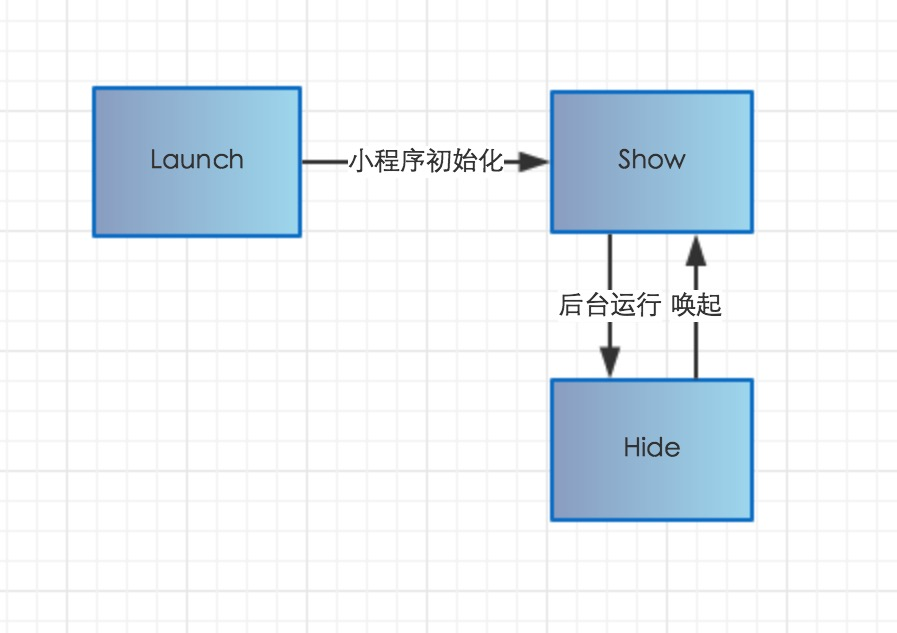

### 导语
 > 微信小程序实例，数据是来源于gank，这是api地址，有兴趣的可以上去看看， [(gank api地址)](http://gank.io/api)
 
### 微信生命周期

#### 原理

### 在app.js中

### 在page中
 

### 部分图例
	
	

 
### 问题
 由于是api中的url是跳转到第三方网址的，目前微信小程序暂不支持外链的跳转，另外也没有先webview的东西存在，当然iframe也不能用，希望后续
 微信小程序能提供这样的类似功能
 
### 后续
1、将福利改成瀑布流的展示方式
2、支持图片下载，放大查看
3、支持提交干货
4、完善'我的'ui
